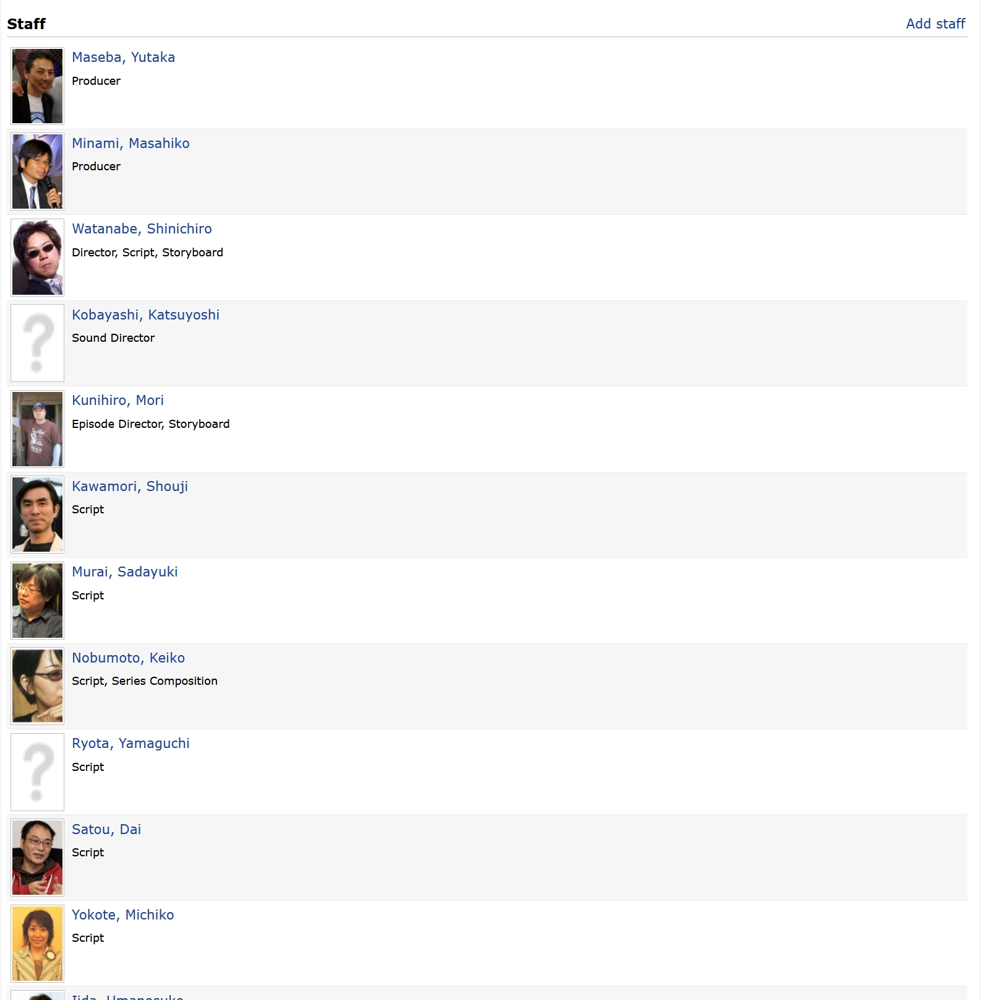
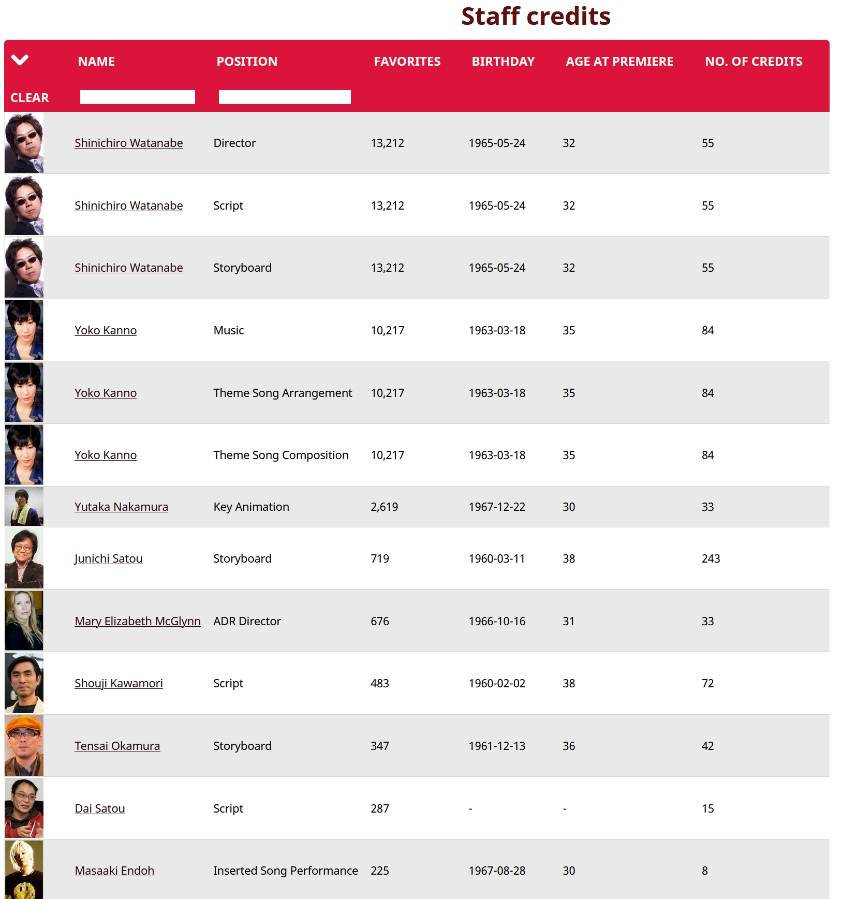
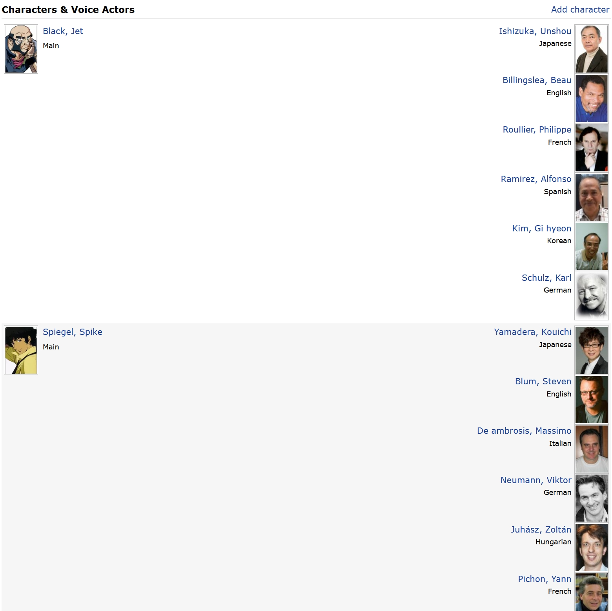
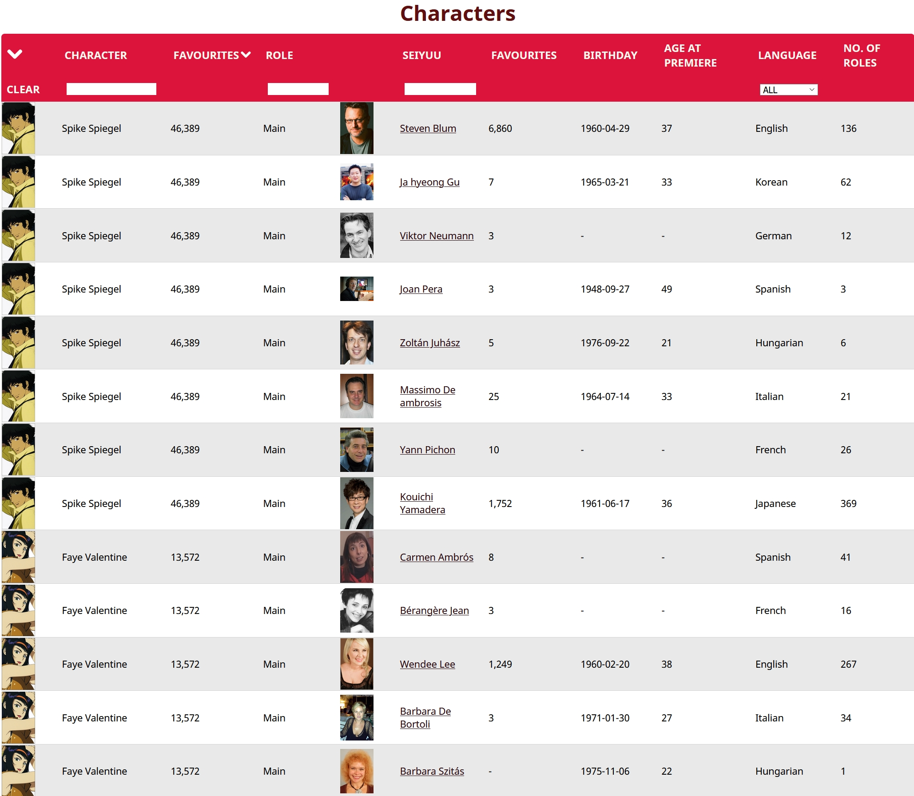

# Better MAL Credits

[bettermalcredits.moe](https://bettermalcredits.moe)

Website that let's you browse, sort and filter credits of anime creators.
```
MAL - My Anime List. A IMDb style website for anime (japanese animation)
```

## Technologies used
- backend - python
  - website itself using Flask framework
  - handling database operations by ORM - SQLAlchemy
  - Celery Task Que for asynchronous operations of downloading and updating pages
  - information on pages taken from My Anime List website via Jikan, it's unofficial API
- no frontend frameworks
  - few javascript files for implementing table sorting and filtering, dynamic searching.
  - no html/css libraries like bootstrap, visual and layout is created using css files.

## Hosting
Website is hosted on a VPS with Debian 10 installed. Everything was set up manually.
Production version is updated using GitHub.

## Main stack
- nginx -> uwsgi -> flask app
- MySQL database
- Celery worker
- VPS with Debian 10

## Demonstration
Take anime "Cowboy Bebop" (as it has id equal to 1 in MAL database) as an example to demonstrate differences between the two sites. 
[Cowboy Bebop - My Anime List](https://myanimelist.net/anime/1/Cowboy_Bebop/characters#staff)
[Cowboy Bebop - Better MAL Credits](https://bettermalcredits.moe/anime/1)

The original site doesn't provide any ability to sort, or filter creators and characters, displaying them in a pretty arbitrary order.

It also doesn't show any additional information about them, like number of appearances of people's favorite lists (which corresponds to this creator/character popularity on the website) or birthday. For those you have to go into their own page.

Additionally, having access to this data, I decided to add 2 additional metrics, that I though would be useful. Namely the age of the creator in the year the show premiered, and their total number of credits. Although the latter one isn't completely accurate for some, as it relies on the number of records in my own database, which is not complete.

My Anime List | Better MAL Credits 
:---: | :---: 
 | 
 | 

